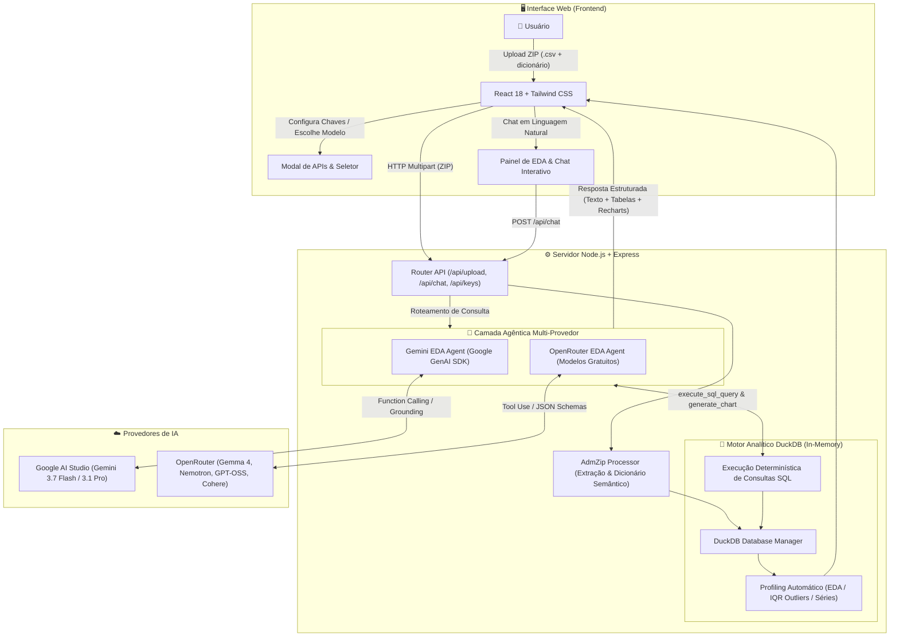
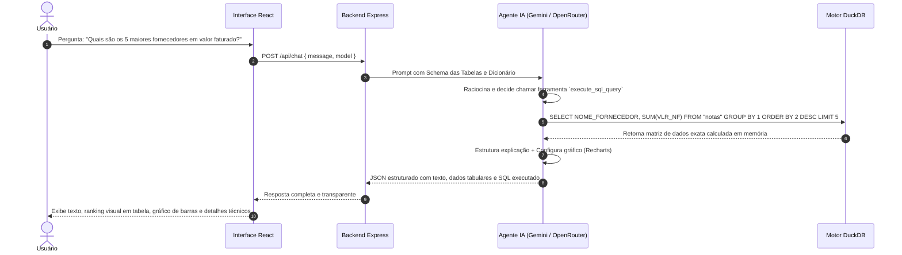

# DataInsight AI — EDA Agent Inteligente para Arquivos CSV

**DataInsight AI** é uma aplicação web full-stack desenvolvida para atender ao **Desafio 4 — Interface Inteligente para Consulta de Arquivos CSV**. Ela combina **Data Profiling Automático (EDA)**, **Execução Analítica em DuckDB** e um **Agente Inteligente de IA Multi-Provedor (Google Gemini + Modelos Gratuitos da OpenRouter)** para permitir consultas e explorações profundas em linguagem natural sem necessidade de SQL.

---

## 1. Objetivo

Permitir que usuários sem conhecimento de programação ou SQL consigam:
1. Enviar arquivos compactados em `.ZIP` contendo um ou múltiplos CSVs e, opcionalmente, um dicionário de dados (`dicionario.csv`, `dictionary.csv`, `README.md`).
2. Obter imediatamente um perfilamento exploratório completo (EDA): contagem de registros, tipos semânticos (moeda, datas brasileiras, categorias, identificadores), valores ausentes, detecção estatística de outliers (critério IQR 1.5x), distribuições de frequência e séries temporais.
3. Fazer perguntas em linguagem natural pelo Chat do Agente selecionando o modelo de IA de sua preferência (**Google Gemini** ou **Modelos Gratuitos OpenRouter** como *Google Gemma 4*, *Cohere North Mini Code*, *NVIDIA Nemotron*, *OpenAI gpt-oss-20b*).
4. Ter os cálculos matemáticos e agregações calculados exclusivamente no **DuckDB** com precisão determinística e transparência (sem alucinações numéricas do LLM).
5. Visualizar respostas com tabelas interativas, gráficos do **Recharts** e o detalhamento técnico da consulta (*"Como a resposta foi obtida"*).

---

## 2. Arquitetura do Sistema



### Fluxo de Execução de Perguntas (Agente + DuckDB)




---

## 3. Modelos de IA Disponíveis

O sistema suporta seleção dinâmica do modelo de inferência no chat:

* **Google AI Studio:**
  * `gemini-3.7-flash` (Raciocínio rápido e analítico)
  * `gemini-3.1-pro-preview` (Alta capacidade de raciocínio lógico)
  * `gemini-3.1-flash-lite` (Latência ultrabaixa)
* **OpenRouter (Modelos 100% Gratuitos):**
  * `google/gemma-4-31b-it:free` (Multimodal com raciocínio e function calling)
  * `google/gemma-4-26b-a4b-it:free` (Mixture-of-Experts ultrarrápido)
  * `openai/gpt-oss-20b:free` (MoE com suporte a tool use e JSON schemas)
  * `cohere/north-mini-code:free` (Otimizado para código SQL e tarefas agênticas)
  * `nvidia/nemotron-3-super-120b-a12b:free` (Raciocínio analítico avançado)
  * `nvidia/nemotron-3-ultra-550b-a55b:free` (Janela de contexto de 1M tokens)
  * `nvidia/nemotron-3-nano-30b-a3b:free` (Consultas rápidas e leves)
  * `openrouter/free` (Auto-router inteligente)

---

## 4. Configuração de Chaves de API e Limites

Você pode configurar as chaves de API de **duas maneiras**:
1. **Pela Interface Web:** Clicando no botão **"Configurar Chaves de API"** na tela inicial ou no cabeçalho do painel.
2. **Pelo arquivo `.env`:** Criando um arquivo `.env` na raiz do projeto com base no `.env.example`.

### Arquivo `.env.example`:
```env
# Google Gemini AI Config (Opcional se usar OpenRouter)
GEMINI_API_KEY=sua_chave_gemini_aqui
GEMINI_MODEL=gemini-3.7-flash

# OpenRouter AI Config (Suporte a Modelos Gratuitos e Comerciais)
OPENROUTER_API_KEY=sua_chave_openrouter_aqui
OPENROUTER_MODEL=google/gemma-4-31b-it:free

# Limite de Upload em Megabytes (Padrão 25MB para Cloud Run/Proxy, pode ser aumentado para 500MB ou mais localmente)
MAX_UPLOAD_SIZE_MB=25
```

---

## 5. Como Executar Localmente

### Pré-requisitos:
* Node.js 18+ instalado.

### 1. Instalar Dependências:
```bash
npm install
```

### 2. Configurar o Ambiente:
```bash
cp .env.example .env
# Adicione sua OPENROUTER_API_KEY ou GEMINI_API_KEY no arquivo .env
# Caso deseje analisar arquivos maiores que 25MB, altere MAX_UPLOAD_SIZE_MB=500
```

### 3. Rodar em Modo de Desenvolvimento:
```bash
npm run dev
```
A aplicação estará disponível em `http://localhost:3000`.

### 4. Compilar para Produção:
```bash
npm run build
npm start
```

---

## 6. Arquivos Maiores que 25MB (Ambiente Local vs Nuvem)

* **Em Nuvem (AI Studio / Cloud Run Preview):** O proxy de entrada possui limite de 25MB (HTTP 413).
* **Em Ambiente Local:** Não há limitação de proxy! Basta configurar `MAX_UPLOAD_SIZE_MB=500` (ou o valor desejado) no `.env`. O DuckDB fará o processamento vetorizado diretamente na sua CPU e memória RAM local.

---

## 7. Exemplos de Perguntas para o Agente

* *"Qual fornecedor teve o maior valor faturado?"*
* *"Quais são os 5 maiores fornecedores?"*
* *"Qual foi o total gasto por mês?"*
* *"Existem valores atípicos ou outliers nos dados?"*
* *"Quais colunas possuem dados faltantes ou nulos?"*
* *"Faça uma análise exploratória completa dos dados."*
* *"Mostre um gráfico dos 10 maiores fornecedores."*
* *"Compare os fornecedores por valor total."*
